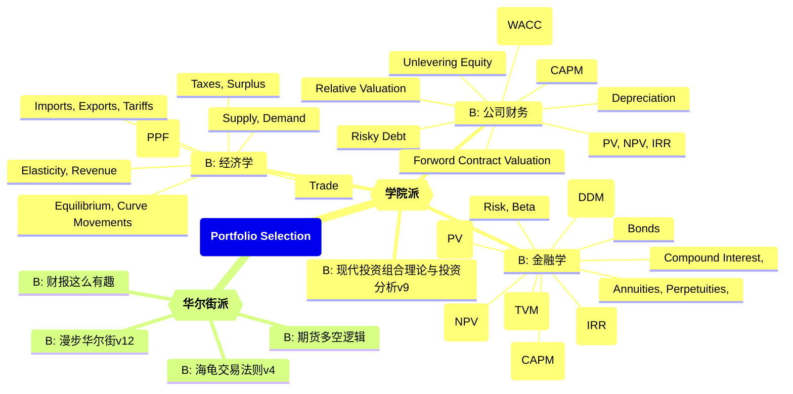

# 投资组合知识图谱

Updated 0851 GMT+8 Aprial 9, 2024

2024 spring, Complied by Hongfei Yan

Portfolio selection refers to the process of choosing a combination of assets or investments to include in an investment portfolio. This process involves analyzing various factors such as risk tolerance, return objectives, investment horizon, and diversification. The goal of portfolio selection is to construct a portfolio that maximizes returns while minimizing risk, taking into account the investor's unique financial situation and investment goals. This typically involves assessing the risk-return tradeoff of different assets, diversifying across asset classes and securities, and periodically rebalancing the portfolio to maintain its desired risk-return profile.

投资组合选择是指选择一组资产或投资品种并纳入投资组合的过程。这一过程涉及分析各种因素，如风险承受能力、收益目标、投资期限和分散投资。投资组合选择的目标是构建一个最大化回报、同时最小化风险的投资组合，考虑到投资者独特的财务状况和投资目标。这通常涉及评估不同资产的风险-回报权衡、跨资产类别和证券进行分散投资，并定期重新平衡投资组合以保持其期望的风险-回报配置。

图：投资组合知识图谱

"学院派"通常指的是理论研究和学术领域中的经济学家、学者或者分析师，他们主要关注经济学理论、宏观经济和微观经济的研究，以及对经济政策的分析和评估。

"华尔街派"则指的是金融界从业者，特别是那些在投资银行、证券公司和投资基金等金融机构工作的人员。他们通常更关注实践性的金融操作、投资策略、市场行情分析以及资产管理等方面。

